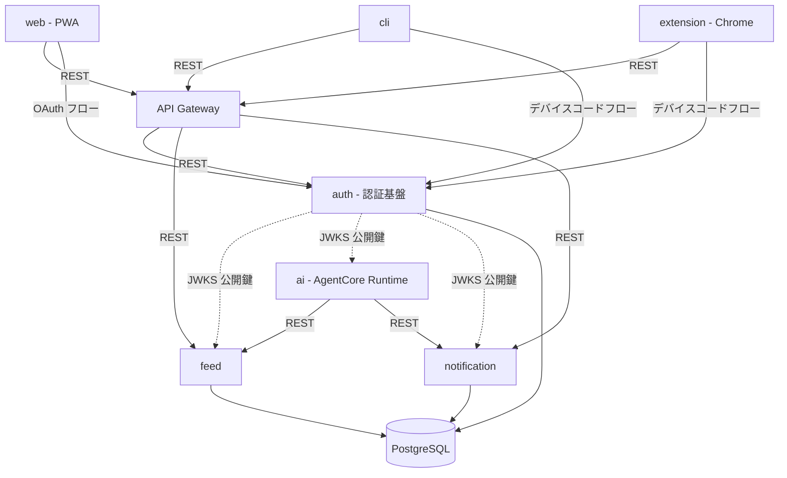
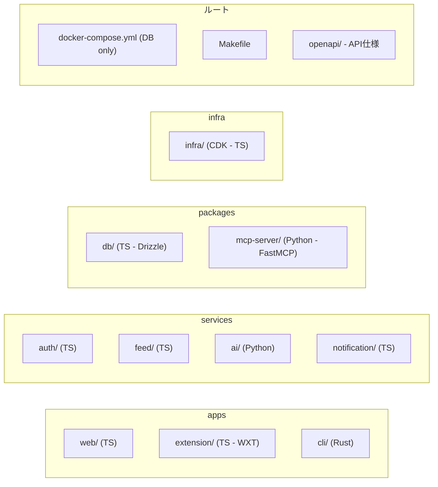
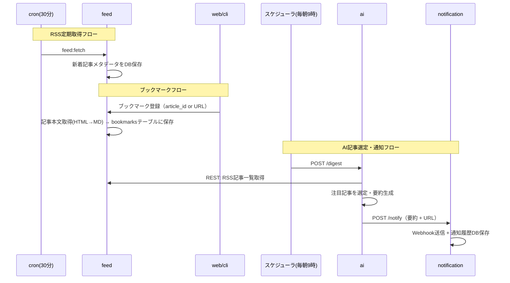
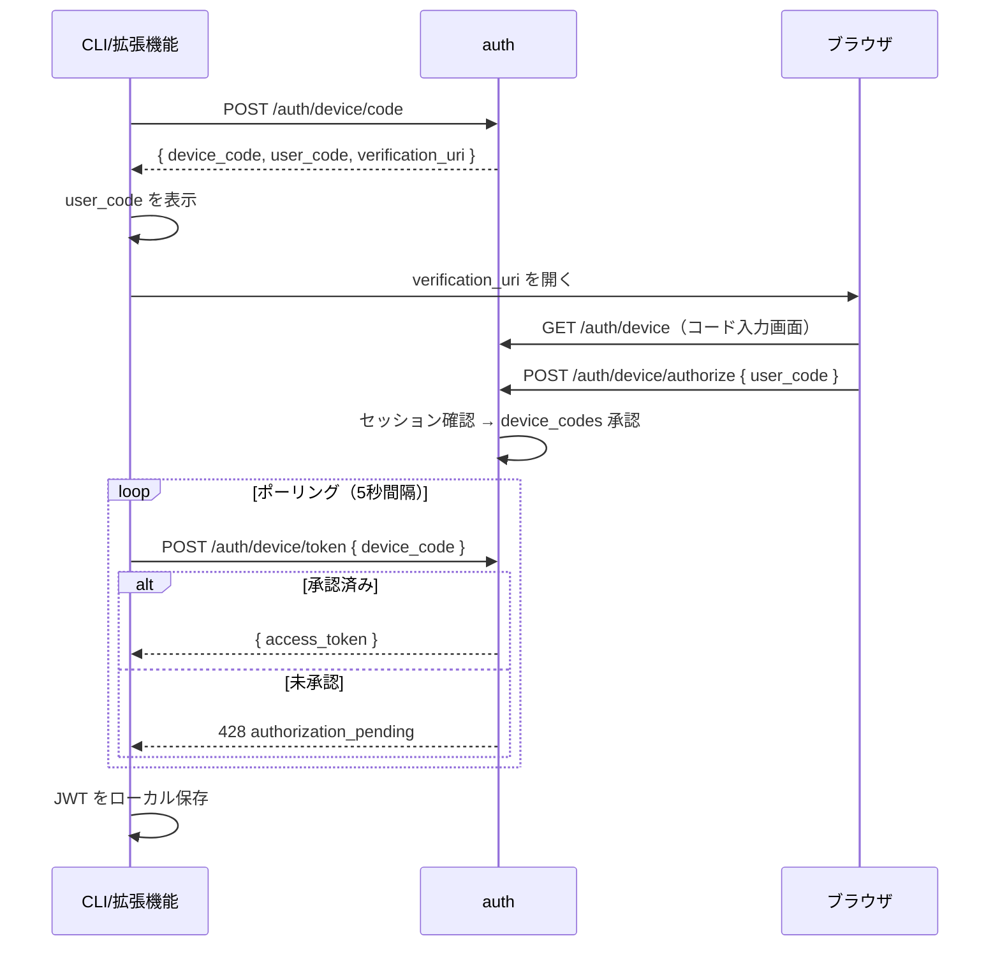
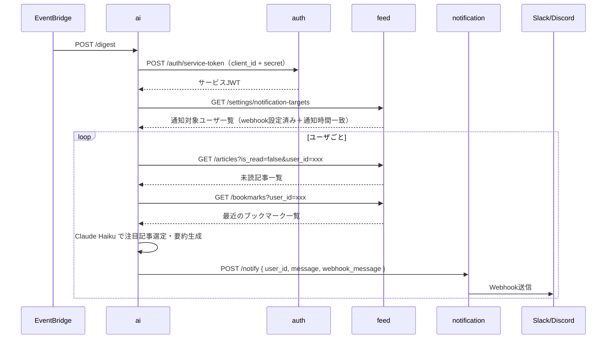
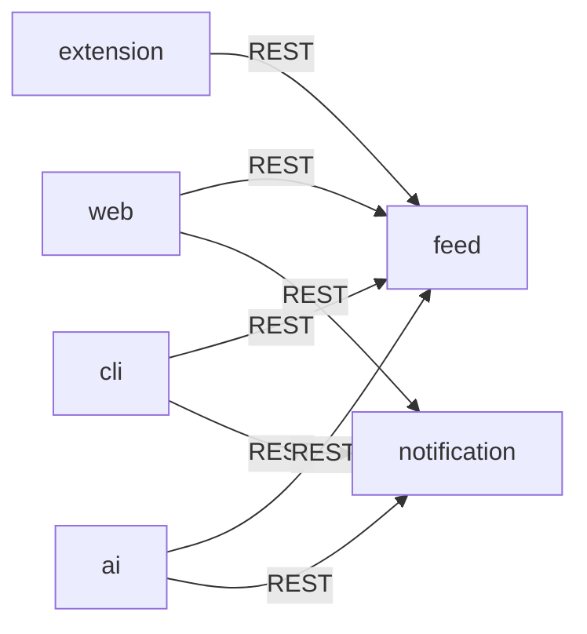

# AI共創基盤 - 技術設計

## 方針

- マイクロサービスアーキテクチャ
- モノレポ構成でgit worktree並行開発に対応
- AI処理はStrands Agents SDK (Python) → AgentCore Runtimeにデプロイ
- 各サービスに最適な言語を採用（TypeScript / Python / Rust）

## サービス構成



> 各サービスはJWKSエンドポイントから公開鍵を取得・キャッシュし、JWTをローカル検証する（authへの都度リクエスト不要）。

### 各サービスの責務

| サービス | 言語 | 層 | 責務 | ポート |
|---|---|---|---|---|
| **auth** | TypeScript | 認証基盤 | Google OAuth、トークン発行、JWKS公開 | 3000 |
| **feed** | TypeScript | データ | フィードCRUD、OPML、定期取得、RSS記事管理、ブックマーク管理（本文抽出・全文検索）、ユーザ設定管理。クライアントから直接アクセスされる公開API | 3001 |
| **ai** | Python | 処理 | 定期ジョブで新着記事を選定・要約し通知送信（Strands Agents SDK → AgentCore） | 3003 |
| **notification** | TypeScript | 処理 | Webhook送信(Slack/Discord)、通知履歴管理。クライアントから直接アクセスされる公開API | 3004 |
| **web** | TypeScript | UI | フロントエンド（PWA） | 5173 |
| **extension** | TypeScript | UI | Chrome拡張機能（ブックマーク登録・検索） | - |
| **cli** | Rust | クライアント | CLI経由で記事検索・ブックマーク操作 | - |

### auth（認証基盤）の責務

独立した認証サービス。ユーザー認証（OAuth）とサービス間認証（サービスJWT）の両方を担当。各サービスはJWKSエンドポイントから公開鍵を取得・キャッシュし、ユーザーJWT・サービスJWTの両方をローカル検証する。

| 機能 | 説明 |
|---|---|
| Google OAuth | OAuthフロー（認可URL発行、コールバック処理） |
| デバイスコードフロー | CLI/拡張機能向け認証（ユーザーコード発行→ブラウザ承認→JWT発行） |
| ユーザーJWT発行 | 認証成功時にJWTを発行 |
| サービスJWT発行 | サービス間認証用JWT発行（`client_id` + `client_secret`で認証） |
| JWKS公開 | 公開鍵エンドポイント（`/.well-known/jwks.json`）。ユーザーJWT・サービスJWT両方の検証に使用 |

全ワークロードの認証フロー:

| クライアント           | 認証方式                                                                   |
| ---------------- | ---------------------------------------------------------------------- |
| **web**          | Google OAuth → JWT取得 → API Gateway経由でfeed/notificationへのリクエストにJWT付与                                |
| **cli**          | `cli login` でデバイスコードフロー実行 → JWTをローカル保存（`~/.config/bookmark-rss/`） → API Gateway経由でfeed/notificationへのリクエストにJWT付与                |
| **extension**    | デバイスコードフローでJWT取得 → chrome.storage.localに保存 → API Gateway経由でfeed/bookmarks APIにJWT付与 |
| **feed**         | 受信: JWKSキャッシュでJWTをローカル検証（ユーザーJWT・サービスJWT両対応）                           |
| **ai**           | 起動時にauthからサービスJWT取得 → feed/notificationへのリクエストに付与。受信: JWKSキャッシュでローカル検証 |
| **notification** | 受信: JWKSキャッシュでJWTをローカル検証（ユーザーJWT・サービスJWT両対応）                           |

### API Gateway 認証（Lambda Authorizer）

API GatewayにLambda Authorizerを配置し、未認証リクエストをLambda到達前に遮断する。各サービス内のHono authミドルウェアも残す（Defence in Depth）。

| パス | Authorizer | 理由 |
|---|---|---|
| `/auth/{proxy+}` | なし | OAuth/JWKS等の公開エンドポイント |
| `/health` | なし | ヘルスチェック |
| その他全ルート | あり | 認証必須 |

Lambda AuthorizerはjoseでJWT署名検証を行い、認証結果をAPI Gatewayに返す。JWKS URLはAuth LambdaのFunction URLを参照する。

### 言語選定の理由

| 言語             | 対象                            | 理由                                                    |
| -------------- | ----------------------------- | ----------------------------------------------------- |
| **TypeScript** | auth, feed, notification, web, extension | DOM解析(readability)はJS/TSが最適。フロントとバックエンドでエコシステム共有      |
| **Python**     | ai                            | Strands Agents SDKのPython版が最も成熟 |
| **Rust**       | cli                           | 高速起動、シングルバイナリ配布、clap による型安全なCLI構築                     |

## 技術スタック

### 共通

| 項目 | 選定 | 理由 |
|---|---|---|
| ローカルDB | Docker Compose（PostgreSQLのみ） | ローカル開発用のDB起動。サービスはホストで直接実行 |
| 本番DB | Supabase（PostgreSQL / Free plan） | マネージドPostgreSQL。全文検索、REST API等を統合提供。認証はBetter Authで管理 |
| メッセージキュー | PostgreSQL（pgmqまたはジョブテーブル+ポーリング） | Redisを追加せずPostgreSQL内で完結 |
| タスクランナー | Makefile | 言語横断のビルド・起動・テストコマンドを統一 |
| IaC | AWS CDK（TypeScript） | Lambda、EventBridge等のAWSリソースをコード管理 |
| API仕様 | OpenAPI | サービス間IFの言語非依存な定義 |

### デプロイ先

| コンポーネント                  | デプロイ先                           | 理由                                                |
| ------------------------ | ------------------------------- | ------------------------------------------------- |
| auth, feed, notification | AWS Lambda（Hono Lambda adapter） | 従量課金、free tier内でほぼ無料。Honoが公式Lambda adapter提供      |
| ai                       | AWS AgentCore Runtime           | サーバーレス、Strands Agents SDKとの統合                     |
| web                      | Vercel（Free plan）               | SSR + CDN + エッジキャッシュを自動最適化。TanStack Startとの親和性が高い |
| cron（feed:fetch, ai:digest）   | Amazon EventBridge Scheduler    | Lambda/AgentCoreの定期トリガー。ほぼ無料                      |
| extension                | Chrome ウェブストア or 手動インストール | Manifest V3、ローカルでも動作可能                            |
| cli                      | バイナリ配布                          | シングルバイナリ、インストール不要                                 |

### TypeScript サービス（auth / feed / notification）

| 項目      | 選定                              | 理由                                           |
| ------- | ------------------------------- | -------------------------------------------- |
| フレームワーク | Hono                            | 軽量、TypeScript-first                          |
| ORM     | Drizzle ORM                     | 型安全、軽量、マイグレーション内蔵                            |
| 認証      | Better Auth                     | Google OAuth、JWT、セッション管理を統合。TypeScript-first |
| RSS解析   | rss-parser                      | 定番                                           |
| HTML→MD | @mozilla/readability + turndown | 本文抽出 + Markdown変換                            |
| バリデーション | zod                             | リクエスト/レスポンスのスキーマ検証                           |
| ログ      | pino                            | 構造化JSON                                      |

### Python サービス（ai）

| 項目 | 選定 | 理由 |
|---|---|---|
| フレームワーク | FastAPI | 非同期対応、型ヒント、OpenAPI自動生成 |
| AI SDK | strands-agents | AgentCoreとの連携、Python版が最も成熟 |
| AgentCore SDK | bedrock-agentcore | Runtime/Memory/Gateway連携 |
| デプロイ先 | AgentCore Runtime | サーバーレス、従量課金 |
| モデル | Amazon Bedrock経由 Claude Haiku | 低コスト、要約タスクに十分な性能 |
| パッケージ管理 | uv | 高速、ロックファイル対応 |
| ログ | structlog | 構造化JSON |

### Rust（cli）

| 項目 | 選定 | 理由 |
|---|---|---|
| CLIフレームワーク | clap | 型安全、サブコマンド、補完生成 |
| HTTPクライアント | reqwest | 非同期HTTP、定番 |
| JSON | serde + serde_json | デファクト |
| ログ | tracing + tracing-subscriber | 構造化JSON出力 |

### フロントエンド（web）

| 項目 | 選定 | 理由 |
|---|---|---|
| フレームワーク | TanStack Start | フルスタックReact。ルーティング・データ取得・サーバー関数を統合 |
| CSS | Tailwind CSS | ユーティリティファースト、コンポーネントライブラリ不要で軽量 |
| PWA | vite-plugin-pwa | Service Worker生成、オフライン対応 |
| Markdown表示 | react-markdown | ブックマーク本文のレンダリング |
| 状態管理 | TanStack Query | サーバー状態管理、キャッシュ（TanStack Startと統合） |

### Chrome拡張機能（extension）

| 項目 | 選定 | 理由 |
|---|---|---|
| フレームワーク | WXT | Viteベース、Manifest V3、TypeScript対応のモダンな拡張機能フレームワーク |
| CSS | Tailwind CSS | webと統一、ユーティリティファースト |
| 認証 | デバイスコードフロー | auth サービスの既存エンドポイント（`/auth/device/*`）を再利用。サービス変更不要 |
| トークン保存 | chrome.storage.local | 拡張機能のローカルストレージ。JWT（30日有効）を保存 |

## モノレポ構成



各サービスは独自のビルドシステムを持つ。

| 言語         | ビルド/パッケージ管理 | 設定ファイル         |
| ---------- | ----------- | -------------- |
| TypeScript | pnpm        | package.json   |
| Python     | uv          | pyproject.toml |
| Rust       | cargo       | Cargo.toml     |

ルートの `Makefile` で言語横断のコマンドを統一する。

```bash
make db           # PostgreSQL起動 (docker compose up -d)
make dev          # 全サービスをローカル起動
make build        # 全サービスビルド
make deploy       # CDKデプロイ（Lambda, EventBridge等）
make test         # 全サービステスト
make feed-dev     # feedサービスのみ起動
make ai-dev       # aiサービスのみ起動
```

### git worktree並行開発

各サービスが独立ディレクトリ・独立ビルドのため、worktreeで別ブランチを切って並行作業が可能。

```bash
# 例: feedサービス(TS)とaiサービス(Python)を並行開発
git worktree add ../ai-cocreation-feed   feature/feed-service
git worktree add ../ai-cocreation-ai     feature/ai-service
```

`openapi/` 配下のAPI仕様でサービス間IFの整合性を担保。

## サービス間IF

### データフロー



### デバイスコードフロー（CLI/拡張機能）



### AIダイジェスト詳細フロー





### 非同期処理

#### PostgreSQL ジョブキュー

feedサービス内部の非同期処理に使用。Redisなしで完結。

| ジョブ種別        | Producer    | Consumer | 内容          |
| ------------ | ----------- | -------- | ----------- |
| `feed:fetch` | cron (feed) | feed     | 30分間隔のRSS取得 |

#### aiサービスのトリガー

aiはAgentCore Runtime（サーバーレス）にデプロイするため、ジョブキューのポーリングは行わない。
外部スケジューラ（EventBridge等）が定期的に `POST /digest` を呼び出してトリガーする。
aiからnotificationへの通知送信もREST（`POST /notify`）で直接呼び出す。

### REST API

#### auth（認証基盤）

独立した認証サービス。ユーザー認証とサービス間認証を担当。

```
# ユーザ認証（OAuth / Better Auth）
POST   /auth/sign-in/social          Google OAuth開始（provider=google）
GET    /auth/callback/{provider}     OAuthコールバック → セッション発行
GET    /auth/get-session             セッション情報取得
POST   /auth/token                   セッションからJWT発行（Better Auth JWTプラグイン）
POST   /auth/sign-out                ログアウト

# カスタム認証エンドポイント
GET    /auth/me               認証ユーザ情報（AuthMeResponse形式）
POST   /auth/service-token    サービスJWT発行（client_id + client_secret）

# JWKS（各サービスが公開鍵を取得しローカルでJWT検証）
GET    /auth/.well-known/jwks.json  JWKS公開鍵（ユーザーJWT・サービスJWT共通）

# デバイスコードフロー（CLI/拡張機能向け）
POST   /auth/device/code      デバイスコード発行（user_code + device_code）
GET    /auth/device            コード入力画面（HTML）
POST   /auth/device/authorize  デバイスコード承認（ブラウザ側、セッション認証）
POST   /auth/device/token      トークンポーリング（CLI/拡張機能側）

```

#### feed-service（公開API）

クライアント(web/cli)およびcron・aiから直接アクセスされる。フィード管理、記事データの一元管理、ユーザ設定管理を担当。

```
# フィード
POST   /feeds                フィード登録（登録後に初回フェッチも実行）
DELETE /feeds/:id             フィード削除
GET    /feeds                 フィード一覧
POST   /feeds/fetch           手動/定期フェッチ実行
POST   /feeds/import-opml     OPMLインポート

# RSS記事（メタデータ）
POST   /articles              記事保存
GET    /articles              記事一覧（フィルタ: feed_id, is_read）
GET    /articles/:id          記事詳細（未読の場合は自動既読更新）
PATCH  /articles/:id          更新（既読）
PATCH  /articles/mark-read-by-url  URL指定で既読更新
PATCH  /articles/bulk-read    一括既読更新（最大100件）
DELETE /articles/:id          記事削除

# ブックマーク（本文あり）
POST   /bookmarks             ブックマーク登録（article_id or URL → 本文抽出・保存）
GET    /bookmarks             ブックマーク一覧
GET    /bookmarks/:id         ブックマーク詳細
DELETE /bookmarks/:id         ブックマーク削除
GET    /bookmarks/search      全文検索

# 設定
GET    /settings                          ユーザ設定取得
PUT    /settings                          ユーザ設定更新（webhook URL等）
GET    /settings/notification-targets     通知対象ユーザ一覧（サービスJWT専用）
```

#### ai-service（処理層）

外部スケジューラ（EventBridge等）から定期的にREST呼び出しで起動。feedサービスからRSS記事を取得し、AIが注目記事を選定・要約してnotificationにREST送信する。DBへの読み書きは行わない。

```
POST   /digest                定期実行トリガー: feed→記事取得→選定・要約→notification送信
```

#### notification-service（公開API）

クライアント(web/cli)およびaiサービスから直接アクセスされる。

```
POST   /notify                通知送信（Webhook送信 + 通知履歴DB保存）
GET    /notifications          通知履歴一覧
PATCH  /notifications/:id      通知既読
```

### CLI コマンド

```
feed list                            フィード一覧
feed add <url>                       フィード追加
feed remove <id>                     フィード削除
feed import <opml-file>              OPMLインポート
article list [--unread] [--feed=id]  RSS記事一覧
article read <id>                    RSS記事詳細表示
bookmark list                        ブックマーク一覧
bookmark add <url|article-id>        ブックマーク追加（URL or RSS記事IDを指定）
bookmark remove <id>                 ブックマーク削除
bookmark read <id>                   ブックマーク本文表示（Markdown出力）
bookmark search <keyword>            ブックマーク全文検索
```

## API型定義

→ [[04.API型定義]] を参照

## データモデル

→ [[03.データモデル]] を参照

## 開発の進め方

→ [[05.開発の進め方]] を参照
